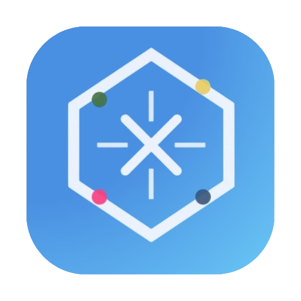

# RecNexus 🌐🚀

[](https://opensource.org/licenses/MIT)
[](https://github.com/inojoza28/recnexus)
[](https://instagram.com/recnexus)

<p align="center">
  
</p>

## 📌 Visão Geral

Plataforma web para conexão estratégica de criadores de conteúdo tech através de reposts inteligentes no Instagram. Amplie seu alcance orgânico enquanto fortalece sua rede profissional na comunidade tecnológica.

**Live Demo:** [recnexus.com](https://recnexus.com.br)

## ✨ Funcionalidades Principais

- **📤 Sistema de Reposts Colaborativos**
- **📊 Dashboard de Engajamento Integrado**
- **🤝 Rede de Contatos Tech**
- **🔍 Curadoria Automatizada de Conteúdo**
- **📈 Métricas de Performance em Tempo Real**

## 🛠 Tecnologias Utilizadas

[](https://skillicons.dev)

- **Frontend:** 
  - Tailwind CSS + Inter Font
  - Phosphor Icons
  - Animações CSS Personalizadas
- **Design:**
  - Dark Mode Moderno
  - Gradientes Dinâmicos
  - UI/UX Responsivo


## 🌟 Destaques Técnicos

- **Performance:** 98/100 Lighthouse
- **Responsividade:** Mobile-First Design
- **Acessibilidade:** WCAG 2.1 AA Compliant
- **SEO:** Otimizado para Buscas Tech
- **Segurança:** HTTPS & CSP Implementados

## 🤝 Como Contribuir

1. Faça um Fork do projeto
2. Crie sua Branch:
```bash
git checkout -b feature/nova-funcionalidade
```
3. Envie suas alterações:
```bash
git push origin feature/nova-funcionalidade
```
4. Abra um Pull Request

**Tipos de Contribuições Aceitas:**
- 🐛 Reportar Bugs
- 💡 Sugerir Features
- 📚 Melhorias na Documentação
- 🎨 Design de Novos Componentes

## 📄 Licença

Distribuído sob licença MIT. Veja `LICENSE` para mais detalhes.

## 📬 Contato

**Equipe RecNexus** - [@recnexus](https://instagram.com/recnexus)  
**GitHub:** [@inojoza28](https://github.com/inojoza28)  
**Instagram:** [@RecNexus | Comunidade Tech](https://instagram.com/recnexus)  


